# A Semi-Supervised Network Embedding Model for Protein Complexes Detection

Protein complex is a group of associated polypeptide chains which plays essential roles in biological process. Given a graph representing protein-protein interactions (PPI) network, it is
critical but non-trivial to detect protein complexes, the subsets of proteins that are closely coupled, from it. Network embedding is a method to learn low-dimensional 
representations of vertices in networks. It has been proved quite useful for community detection
in social networks in recent years. However, unlike social networks, PPI network does not contain rich metadata, so that existing network embedding methods
cannot fully capture the network structure to hugely improve the effect of protein complexes detection. In this paper, we propose a semi-supervised
network embedding model by adopting graph convolutional networks to effectively detect densely connected subgraphs. We
compare the performance of our model with state-of-the-art approaches on three popular PPI networks with various data sizes and 
densities. The experimental results show that our approach significantly outperforms other approaches on all three PPI networks.

## Introduction
Protein complex is a complex graph structure that is linked by protein-protein interactions (PPI) , which plays an essential role in biological process and drug discovery in pharmaceutical process. Therefore, correctly identifying protein complexes in PPI network is useful in the field of biomedical sciences. However, with the huge increase of PPI data, only a small amount of protein complexes are identified in vitro because of the bottleneck of experimental approaches that require a large amount of labor resource .

To overcome the technological limit of experimental approaches for protein complexes detection, computational approaches are used. The PPI network can be represented as an undirected and unweighted graph where proteins are represented as vertices and their interactions as edges. Each protein complex consists of two or more proteins that are shown as densely connected subgraphs, which indicates graph based clustering methods should be utilized to discover them.

For example, used clique finding algorithms to predict protein complexes from PPI network. They devised their own methods to merge overlapping cliques as protein complexes. Besides, introduced Markov Clustering (MCL) as graph partitioning method by simulating random walks, which used two operators called expansion and inflation to boost strong connections and demotes weak connections. Later, showed the robustness of MCL with comparison to three other clustering algorithms for protein complex detection. One of the recent emerging methods is to first identify cores of a protein complex, and then add attachments into these cores to form protein complexes . further evaluated the implementation of this method called COACH against other methods, and proved that COACH outperforms others on two PPI datasets. Though later some methods proposed by other researchers achieved better clustering performance but their methods require additional information to perform with many limitations.

Recently, network embedding has been widely studied and proved that it can further improve the performance of many graph clustering methods , which is also the main focus of this paper. Network embedding learns low-dimensional representations of vertexes in networks to capture and preserve the network structure. However, most of existing network embedding methods heavily relies on the attributes of each vertex in the network, which is not suitable for PPI network. As shown in Figure 1 , there is no any metadata associated with each node except protein name. In other words, existing network embedding methods cannot fully capture PPI network structure because no sufficient information can be used to compute the first-order and the second-order proximity .

To overcome this issue, we propose a semi-supervised network embedding model by adopting graph convolutional networks (GCN) that can capture both local and global structure. Our contributions are two-fold. Firstly, we introduce a method to effectively exploit the first-order proximity even there is no any information associated with each vertex in PPI network. Secondly, we design a GCN based auto-encoder to preserve the second-order proximity. To prove that our model is robust and feasible, we evaluated our model on three PPI datasets with well known benchmark complexes.

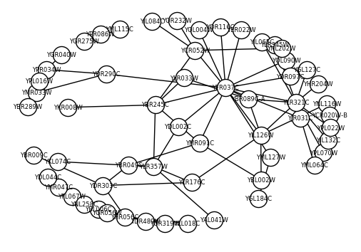

&emsp;&emsp;&emsp;&emsp;&emsp;&emsp;Figure 1: Sample of PPI Network

## Proposed Model

PPI data come in the form of connections between proteins, which is easily described as a graph model. Proteins are represented as vertices and their interactions are represented as edges in the graph. Assume we have a graph *G* = (*V*, *E*), where *V* represents a set of vertices in the graph, *V* = *v*1, ..., *v**n*. *E* represent a set of edges in the graph, *E* = *e*1, ..., *e**n*. Each edge is associated with two vertices. For PPI network, there is no weight for edges.

As we mentioned earlier, our goal is to have a network embedding model that can effectively capture the local and global structure of PPI network, so the the clustering performance can be further improved. Therefore, we first define the first-order proximity, which can specifically characterize the local structure of PPI network as shown in Definition 1.

**Definition 1** *The first-order proximity describes the pairwise similarity between vertices. For any pair of vertices, if there is an edge between *v**i* and *v**j*, there is a positive first-order proximity between *v**i* and *v**j*. Otherwise, the first-order proximity between *v**i* and *v**j* is 0.*

From this definition, we can easily know that the computation of the pairwise similarity
between two vertices is the key to exploit the first-order proximity. Unlike
social networks, we need to design a method to perform the computation because there is
no attributes attached to each vertex in PPI network.

On the other hand, we also need to define the second-order proximity, which can
specifically characterize the global structure of PPI network as shown in
Definition 2.

**Definition 2** *The second-order proximity describes the pairwise similarity between vertices’ neighborhood structure. Let *N**i* and *N**j* denote the set of neighbor vertices of *v**i* and *v**j*, then the second-order proximity is determined by the similarity of *N**i* and *N**j*.*

From this definition, we can infer that the second-order proximity between two vertices is high if two vertices share many common neighbors. The second-order proximity has been demonstrated to be a good metric to define the similarity of a pair of vertices, even if they are not linked by an edge, and thus can highly enrich the relationship of vertices .

On the basis of above discussion, we wrap all up into a semi-supervised network embedding model as shown in Figure in order to preserve both the local and global structure. The component for the first-order proximity is supervised and designed for pairwise similarity calculation between two vertices based on DeepWalk . The component for the second-order proximity is unsupervised and designed for pairwise similarity calculation between two vertices’ neighborhood using a structure reconstruction method based on GCN. We will introduce these two components in the following sections.

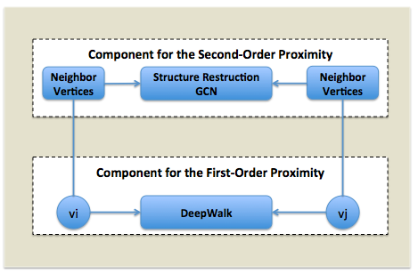

&emsp;&emsp;&emsp;&emsp;Figure 2: Proposed Semi-Supervised Network Embedding Model

### Component for the First-Order Proximity

As we described earlier, there is no attributes attached to each vertex in PPI network. Therefore, to compute the pairwise similarity between vertices, we need to create a set of attributes for each vertex. Considering the definition of protein complex, we may set the important neighbor vertices of each vertex as its attributes because these neighbor vertices have higher probability to be grouped together as a protein complex. We propose a method to select vertices from the neighbor vertices of a vertex that have higher tightness to this vertex based on vectors generated by DeepWalk . DeepWalk has been proved successfully in social networks and graph analysis. It learns the latent representations by modeling a stream of short random walk, and then encodes it in a continuous vector space with low dimensions. In our purposed method, we first apply DeepWalk to the graph to get a 64-dimensions vector for each vertex. Let *G* = (*V*, *E*) to be the graph, *v* ∈ *V*, which represents a protein. *H* is the set of neighbor vertices of *v*, *h**i* ∈ *H*, *n* is the number of the neighbor vertices of *v*. We then use Euclidean metric to compute the tightness score *S**c**o**r**e**v*, *h**i* between *v* and each *h**i*. Lastly, we keep those neighbor vertices that have tightness score higher than average tightness score of neighbor vertices as attributes of *v*. The neighbor vertices selection process is described in Algorithm 1.

Once we have the attributes for each vertex, we then can use the attributes as supervised information to exploit the first-order proximity and refine the representations in the latent space to constrain the similarity of a pair of vertexes.

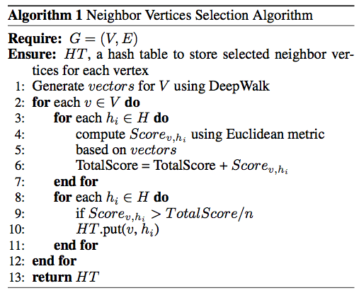

### Component for the Second-Order proximity

The second-order proximity refers to how similar the neighborhood structure of a pair of vertexes is. Thus, to model the second-order proximity, it is required to model the neighborhood of each vertex. Assume we have a graph *G* = (*V*, *E*), we can obtain its adjacency matrix *M*, which contains *n* instances *m*1, ..., *m**n*. For each instance *m**i* = *m**i*, *j**j* = 1*n*, *m**i*, *j* &gt; 0 if and only if there exists a link between *v**i* and *v**j*. The *m**i* describes the neighborhood structure of the vertex *v**i* and *M* provides the information of the neighborhood structure of each vertex. Therefore, we design a GCN based auto-encoder to preserve the second-order proximity of *G*.

GCN can make use of latent variables and is capable of learning interpretable latent representations for undirected, unweighted graphs, which is very suitable for PPI network. As shown in Figure , we use the attributes from each vertex as input channels of the GCN, and then after encoding of *l* convolutional layers, we can get a representation that is learned from the original graph. For the decoding part, we simply use an inner product decoder.

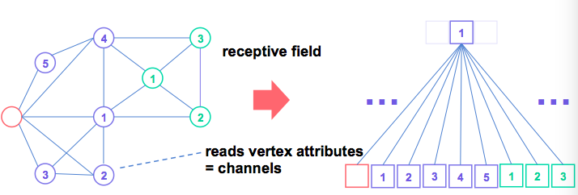

&emsp;&emsp;&emsp;&emsp;Figure 3: Sample of GCN

In our proposed model, we can naturally incorporate vertices' attributes to simultaneously optimize the first-order and second-order proximity referring to the following definition:

**Definition 3** *Given an undirected, unweighted graph *G* = (*V*, *E*) with *N* = |*V*| vertices. We have an adjacency matrix *A* of *G* and an *N* × *D* matrix *X* as input. With a stochastic latent variables *z**i*, we can summarize an *N* × *F* output matrix *Z*. where *F* is the number of output attributes.*

In this definition, *D* is the number of attributes per vertex. As the attributes are generated based on the selected neighbor vertices. In other words, the number of attributes for each vertex is different. Therefore, we set *N* to be the value of *D* initially. When constructing *X*, we set relevant elements to 0 if the vertex does not has these attributes. Every network layer can then be written as a non-linear function:

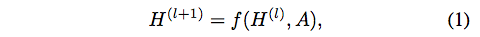

where *H*(0) = *X* and *H*(*L*) = *Z*, *L* is the number of layers. We then set the following propagation rule:

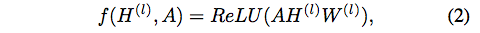

where *W*(*l*) is a weight matrix for the *l*-th network layer and ReLU is the activation function. Note that the multiplication with *A* only sums up all attributes of all neighbor vertices not the vertex itself. Therefore, we need to add an identity matrix *I* to *A*. Then the Equation (2) becomes:

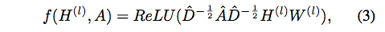

$\\hat{A} = A + I$
where $\\hat{A} = A + I and $\\hat{D}$ is the diagonal vertex degree matrix of $\\hat{A}$. We set the *L* = 3, which means the network has three convolutional layers to reconstruct the structure of *A* to get *Z*. Assume we decide to keep half number of attributes from previous layer in every layer in this work, we have $F = \\frac{D}{2^L}= \\frac{D}{8}$ after three layers.

### Model Optimization

As described earlier, our model needs to simultaneously preserve the local and
global structure. In other words, a jointly optimization mechanism is needed for
the first-order and the second-order proximity.

For our model, we use a common graph Laplacian regularization term loss
function to optimize:

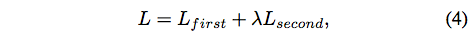

where *L**f**i**r**s**t* denotes the supervised loss of the first-order proximity, the labeled part of the graph. *L**s**e**c**o**n**d* denotes the unsupervised loss of the second-order proximity, and *λ* is a trade-off factor between *L**f**i**r**s**t* and *L**s**e**c**o**n**d*.

For *L**f**i**r**s**t*, we can simply define it as:

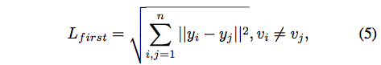

where *v**i* and *v**j* are two vertices linked by an edge. *y**i* and *y**j* are two matrices constructed based on selected neighbor vertices and a 64-dimensions vector represents each vertex generated by DeepWalk. Since the number of neighbor vertices for each vertex may be different, we use zero elements to fill up the smaller matrix to make sure both matrices have the same size in order to perform this computation.

For the *L**s**e**c**o**n**d*, we define it as:

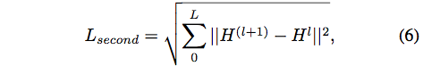

where $H^{(0)} = N \\times D, H^{(l)} = N \\times \\frac{D}{2^l}$. Again, we also Use zero element to fill up the smaller matrix to make sure subtraction between matrices can be performed.

According to the Equation (5) and Equation (6), we can easily know that we need to minimize *D*, which in fact is constructed based on selected neighbor vertices in order to jointly minimize *L**f**i**r**s**t* and *L**s**e**c**o**n**d* so that *L* can be minimized.

If we refer to the Definition 3, the optimization problem becomes a matrix dimensionality reduction problem. In this work, we use the tradition singular value decomposition (SVD) method to perform this task. According to the theorem of SVD, a matrix *X* with size *N* × *D* can be rewritten as *U* × *S* × *V*\*, where *U* is the orthogonal matrix of *X* with size *N* × *N*, *S* is the diagonal matrix of *X* with size *N* × *D*, and *V*\* is the conjugate transpose of the orthogonal matrix with size *D* × *D*. *S* is also called the singular values of *X*. If we set the smallest of the top certain percentage *P* of the singular values to zero, then we can get the approximated matrix of *X*, namely *X*′. Eventually, the value of *D* is reduced. However, because we want to minimize the reconstruction error of *X* → *X*′, we have to maximize the value of 1 − *P*. Because *X*′ = (1 − *P*)*X* after we perform the multiplication using SVD, and *X* is a *N* × *D* matrix, therefore, we can convert the problem to a goal programming problem[1] as shown in Equation (7), Equation (8), and Equation (9):

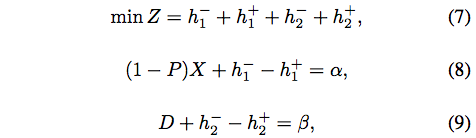

where *α* is the matrix with the maximum number of *D*, and *β* is the minimum number of *D*, *h*1−, *h*1+ are positive and negative deviation variables for the first objective, and *h*2−, *h*2+ are the positive and negative deviation variables for the second objective. In this work, we treat both positive and negative deviation variables are equally important that means the weight is 1 for each of them. Obviously, when *Z* is equal to zero, we can get a Pareto optimal solution[1]. Therefore, we keep updating the *α* and *β* until we found the combination that can make *Z* closes or equals to zero.

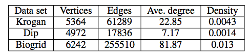

&emsp;&emsp;&emsp;&emsp;Table 1: Features of PPI datasets

For hyperparameter optimization, we set dropout rate to 0.2 for all layers, L2
regularization factor for each convolutional layer and number of hidden units.
We train the model for a maximum of 200 epochs using Adam optimizer \cite{2014King} with
a learning rate of 0.01 and early stopping with a window size of 10.

## Evaluation

In this section, we show our experiments on three PPI data sets to demonstrate the performance of our model by comparing it with state-of-the-art methods. The experiments were performed on a desktop with i7 CPU dual core 4.00GHZ, 16GB memory, and a GTX 1070 card. The calculation of the whole process can be completed in less than one day on all three data sets, which is acceptable. In addition, since PPI data clustering usually is one-off process in the real world, we do not focus on running time improvement and time complexity analysis in this research because clustering quality is much important.

### Data Corpus and Evaluation Metrics

We used the latest three popular PPI data sets for *Saccharomyces cerevisiae*, namely, Krogan , Dip and Biogrid . The Krogan and dip data sets were used by Li et al. to evaluate the performance of several clustering algorithms. As shown in Table 1, Krogan and Dip data sets have similar number of average degree and density, but Biogrid has much higher average degree and density than them. Because PPI data can be represented as a undirected graph *G* = (*V*, *E*), thus, the average degree is calculated as $\\frac{2 \\times |E|}{|V|}$, and the density is calculated as $\\frac{2 \\times |E|}{|V|\\times (|V| - 1)}$.

PPI data have a high rate of false positives, which has been estimated to be about 50% . The noise of the data disturbs clustering methods to detect protein complexes from PPI data. Thus, we used CYC2008 complexes as a reference data set, which was published by Pu et al. . CYC2008 provides a comprehensive catalogue of manually curated 408 protein complexes in Saccharoyces cerevisiae, and has 90% more complexes than the other popular data set MIPS .

We used neighbourhood affinity score to see whether a complex detected by an algorithm is matched with protein complexes in the CYC2008, which is the same as many others, e.g., Li et al. . We then used it to calculate the precision, recall, and F-measure to evaluate the performance of an algorithm. The neighbourhood affinity score *N**A*(*p*, *b*) is defined as follows:

where *P* = (*V**p*, *E**p*) is a predicted complex and *B* = (*V**b*, *E**b*) is a benchmark complex. We then have the precision calculated as follows:

where $ N\_{cp}=\\mid \\{p\\mid p \\in P, NA(p,b) \\geq \\omega,
            \\,\\mbox{\\fontsize{8}{10}\\selectfont for}\\,\\exists b \\in B\\}\\mid$.
The recall is calculated as follows:

where *N**c**b* = ∣{*b* ∣ *b* ∈ *B*, *N**A*(*p*, *b*)≥*ω*,  *f**o**r*∃*p* ∈ *P*}∣.

The F-measure is the precision, recall, and F-measure harmonic mean of Precision and recall as follows:

The *ω* is a threshold, which indicates if a protein complex is identified for any protein complex in the benchmark data set. According to our experiments and the recommendation by , we set the neighbourhood affinity score threshold as 0.25, which made the difference of performance among various algorithms.

In addition, we also used three indicators to measure the quality of clustered protein complexes, Fraction (Frac), Maximum Matching Ratio (MMR) and Geometry Accuracy (Acc) . Frac is an indicator that measures the fraction of pairs between two protein complexes with an overlap score *θ* larger than 0.25, where Frac(*θ*) is calculated as below:

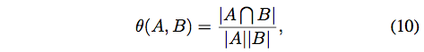

where *A* and *B* are two protein complexes.

Acc is the geometric mean of two other measures: the clustering-wise
sensitivity (Sn) and the clustering-wise positive predictive value (PPV). The
Sn and PPV are:

where *n* are the number of proteins of reference protein complexes and *m* are the number of proteins of clustered protein complexes. The element *t**i**j* refers to the number of proteins that are found in both complexes. Because Sn can be inflated by putting every protein in the same complex while the PPV can be maximized by putting every protein in its own complex, we then have these two measures to compute the geometric mean of Sn and PPV:

&emsp;&emsp;&emsp;&emsp;Acc = .

MMR represents the two sets of clustered protein complexes as a bipartite graph where the two sets of nodes represent the reference and predicted complexes, respectively, and an edge connecting a reference complex with a predicted one is weighted by the overlap score. The overlap score between two protein complexes is computed by Equation (10). The value of the MMR is given by the total weight of particular subset of edges that have maximum weight, divided by the number of reference protein complexes. This measure expresses how well the clustered protein complexes represent the reference ones.

### Evaluation Results

As COACH is the most stable and representative clustering method for PPI network so far according to our study, we use it as the clustering method to evaluate our model. We compared the performance of our model with two state-of-the-art network embedding models, DeepWalk and SDNE . To evaluate the robustness of our model, we also choose two different types of traditional clustering methods, K-means and DBSCAN to compare. For COACH, we set the three key parameters of this method, namely, DENSITY, AFFINITY, and CLOSENESS, to 0.7, 0.2 and 0.5, respectively, according to our experimental analysis that can achieve stable performance with all network embedding methods. For the parameters of K-means and DBSCAN, we just use the default settings.

Because SDNE also requires the first-order proximity but due to it is designed for social networks originally, we implemented three versions of SDNE, no attributes for each vertex, namely SDNE-NA, use all neighbor vertices as attributes for each vertex, namely SDNE-ALL, use selected neighbor vertices as attributes for each vertex, namely SDNE-SN. The neighbor vertices selection method is the same as we described in Algorithm 1.

### Comparison Test

The results of precision, recall and F-measure on different data sets are presented in Figure 4, Figure 5 and Figure 6, respectively.

From the results, we learn that our approach outperforms others on all three data sets in terms of precision, recall and F-measure. Particularly on the Biogrid data set that has high density, our model achieves at least 90% higher F-measure value than the model in the second place. On the Dip data set, our model achieves the highest 0.528 F-Measure, which is around 20% higher than using COACH only. Our model is also 9.5% higher than the COACH+SDNE-SN method that is the second best method, and 17% higher than the COACH+DeepWalk method. Similar outcomes are also found on Krogan data set. These results prove that our network embedding model is more appropriate than other models on the network with high density.

In addition, we find that SDNE-SN is better than SDNE-NA and SDNE-ALL on all three corpora. Because SDNE-SN is implemented based on our proposed Algorithm 1 to calculated the first-order proximity, the results prove the effectiveness of our model from the side.

For K-means and DBSCAN clustering methods, both are quite disappointed on this task. No matter what kind of network embedding methods to use together, the experimental results are not very good, which means these two methods are not suitable for PPI network.

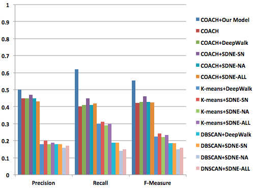

&emsp;&emsp;&emsp;&emsp;Figure 4: Comparison results on Krogan data set

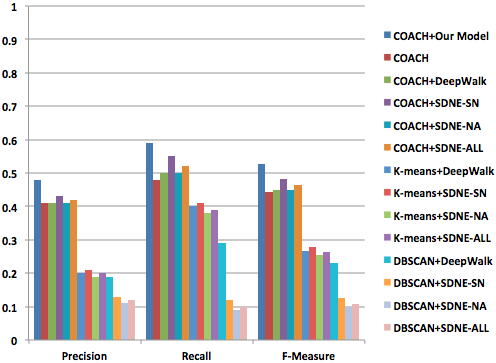

&emsp;&emsp;&emsp;&emsp;Figure 5: Comparison results on Dip data set

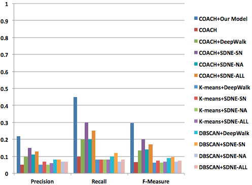

&emsp;&emsp;&emsp;&emsp;Figure 6: Comparison results on Biogrid data set

### Quality Measurement

In this section, we compare the clustering quality of each method. According to the results of previous section, we only select three representative methods to compare, COACH, COACH+DeepWalk and COACH＋SDNE-SN. Table shows the number of protein complexes detected by different methods. From this table, we can find that our model can detect more protein complexes that others on all three corpora. Having the basis of this quantity, it is easier to improve the quality of clustering.

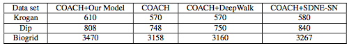

&emsp;&emsp;&emsp;&emsp;Table 2: Number of Protein Complexes Detected by Different Methods

Table 3, 4 and 5 show the clustering quality comparisons on Krogan, Dip and Biogrid data set respectively. From the Table  , we can see that our model can achieve better clustering quality, which is around 38% higher than the COACH+SDNE-SN that is the second best in terms of MMR and Frac, and around 25% higher for Acc. Similar situation also happened on the Dip data set.

For the Biogrid data set, the clustering quality of all models is dropped dramatically due to the high density of this network. However, our model still outperforms others. For example, our model achieves 0.69 “Acc” value, which is approximately 25% higher than the COACH+SDNE-SN, which is in the second place.

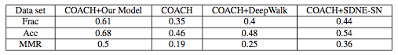

&emsp;&emsp;&emsp;&emsp;Table 3: Quality of the Clustered Protein Complexes from Krogan Data Set}

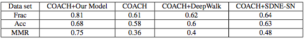

&emsp;&emsp;&emsp;&emsp;Table 4: Quality of the Clustered Protein Complexes from Dip Data Set

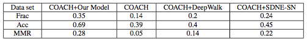

&emsp;&emsp;&emsp;&emsp;Table 5: Quality of the Clustered Protein Complexes from Biogrid Data Set

## Conclusions and Future Work

Detecting protein complexes in PPI network is an important task in the field of biomedical sciences. Thus, with advances in technology, the size of PPI network is growing much faster than ever but does not contain rich metadata like social networks, which makes the task non-trivial. In this study, we propose a semi-supervised network embedding model that can fully capture the network structure that can help to improve the performance of protein complexes detection.

Compared with other network embedding methods, we design an algorithm to select critical neighbour vertices as attributes for each vertex so that the first-order proximity can be exploited. In addition, we design a three layers GCN deeply learn the structure of PPI networks to preserve the second-order proximity.

Extensive experiments performed on various PPI networks show that our model is robust and outperforms other state-of-the-art approaches on various indicators. In the future, we plan to integrate information from biomedical literature using recurrent neural network into PPI networks, which shall further improve the performance of protein complexes detection.

